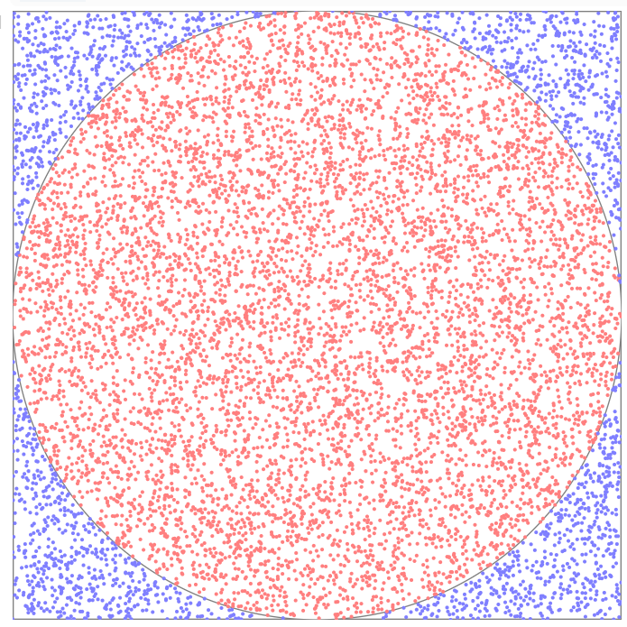

# Estimating Pi: The Monte Carlo Method

Initial completion date: Apr 18, 2021\
Last update: Oct 2, 2021\
Owner: Alison Zhang\
Credit: A simulation of the Monte Carlo method, developed by Stanislaw Ulam (1940s)\

## The Math Behind Approximating Pi

Let U1 and U2 be independent U(-1,1) random variables.

The probability that (U1, U2) is in the unit circle C = { (x1, x2): x_12 + x_22 ≤ 1 } is around the value of Pi! The more samples you draw from the uniform distribution, the more accurate this estimate will be. Below is a graph visualization of 100,000 drawings of uniform RVs.

For more statistics and mathematical proof, see https://blogs.sas.com/content/iml/2016/03/14/monte-carlo-estimates-of-pi.html.